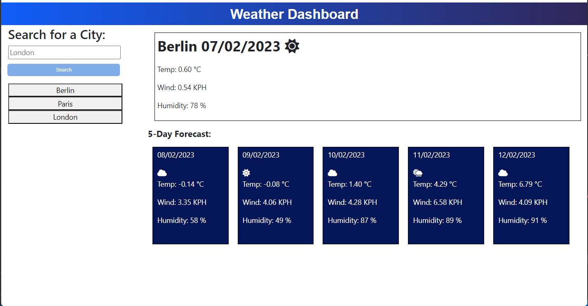

# Weather-Dashboard-Server-Side-APIs
Weather dashboard running in the browser and featuring dynamically updated HTML and CSS.

## Description

This project presents a weather dashboard application that runs in the browser. User enters the name of a city and click search. The program will search for the weather information of that city and present on the screen the weather for the present day and the forecast for the following five days. The name of the city will appear on the screen (history of cities searched) and if clicked it will display the weather information of the city again. The search history will be stored in local store and it will be loaded the next session.
Building the application has given me the opportunity of consolidating fundamental principles of programming.

## Usage

See description.

Link to the application deploid:   https://pedrobe9.github.io/Weather-Dashboard-Server-Side-APIs/
Link to GitHUb repository:   https://github.com/Pedrobe9/Weather-Dashboard-Server-Side-APIs  

## Credits

To produce this project I have used w3school (https://www.w3schools.com/js/default.asp) and mdn (https://developer.mozilla.org/es/) website to consult.

## License

MIT license

